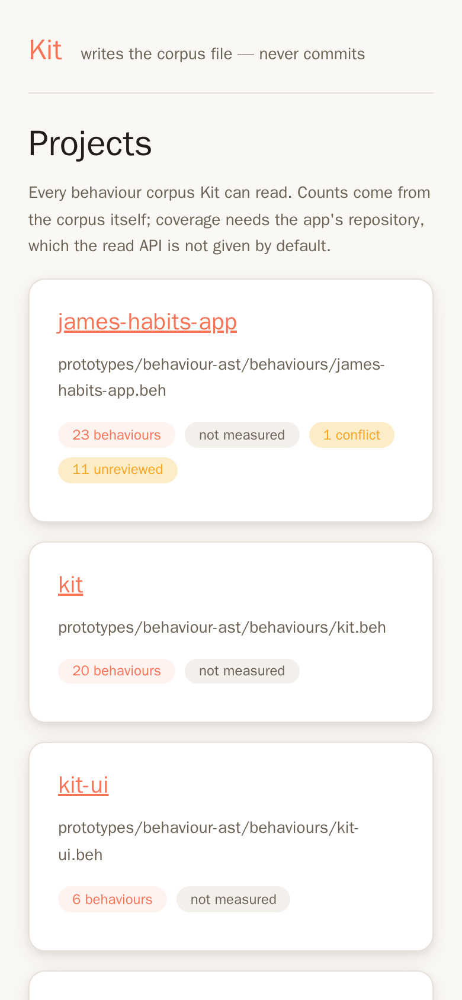
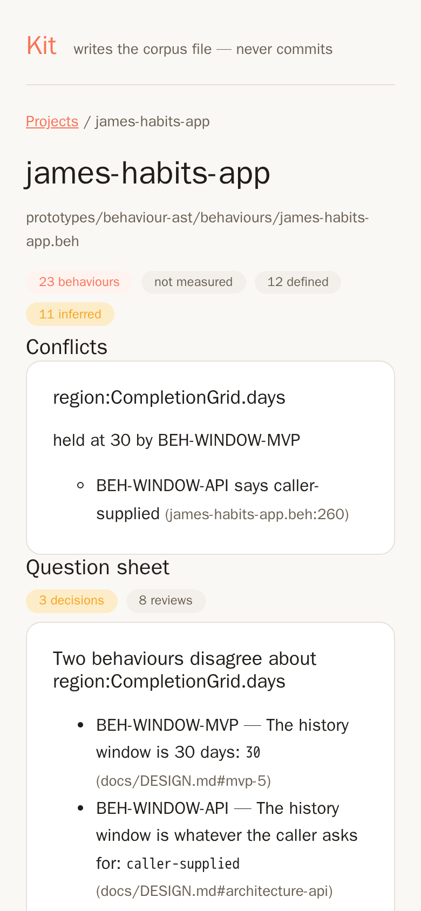

# Kit in five minutes, on your own laptop

Kit runs locally today. It needs no merge, no cluster, no image, no secret and no
deployment — everything in this document worked on an ordinary machine on
2026-09-23, and every number and screenshot below came from that run.

```
git clone https://github.com/jemmy8oy-northstar/kit
cd kit
node start.js
```

Then open **http://127.0.0.1:4321**.

That is the whole thing. The first run installs and builds the UI (7 seconds on
the machine this was measured on), then serves. There is no second command, no
config file and no account.

## What you get

Nine behaviour corpora are already in the repo, so there is something to look at
before you have written anything:



Each card is one `.beh` file. The counts come from the corpus itself. **`not
measured` is not `0%`** — coverage needs the repository the app lives in, which
the read API is deliberately not given. Start Kit with `--repos ~/code` and it
measures instead:

```
node start.js --repos ~/code
```

## The bit that is actually different

Every card that says **`n conflicts`** is the feature nothing else ships:
contradiction detection over an accumulated corpus. It is not a model call and
not a similarity score — two behaviours asserting different values for the same
`noun.slot` collide in a `Map`, so it is exact, instant and free.

Opening `james-habits-app` shows a real one, found in a real spec:



Kit reports that `region:CompletionGrid.days` is held at `30` by `BEH-WINDOW-MVP`
while `BEH-WINDOW-API` says `caller-supplied`, and cites the line of each.

The question sheet underneath goes further than the collision. It records that
the two sides only contradict **on paper** — a caller-supplied window defaulting
to 30 satisfies both — and that the real disagreement is a **name**: `docs/DESIGN.md`
documents `?days=30`, the route binds `?historyDays`. It then gives both options
with what each one costs, and a recommendation:

> **Rename the code to `days`** — `HabitRoutes.cs:68` binds `int days = 30` and
> `HabitApiTests.cs:182` follows. A frontend written from `DESIGN.md` then works.
> It is a breaking query-parameter change to a route, and the generated API
> client needs regenerating.
>
> **Rename the design to `historyDays`** — `DESIGN.md:83` becomes
> `?historyDays=30`. No code moves, no client regenerates, nothing can break.
> The document a human and an assistant read to build the screen gets the uglier
> of the two names.

That is the loop Kit exists for: the spec disagreed with the code, and the
disagreement became a decision with a cost against each side, rather than a bug
found six weeks later by whoever built the screen.

## What it will not do

- **It never commits.** Edits land in your working tree as an ordinary diff you
  review. There is no hidden write.
- **Writes are refused unless it is bound to loopback**, so the default really is
  a local tool.
- **Contradiction detection is same-noun only.** Two behaviours that describe one
  control under different names do not collide and Kit reports nothing — see the
  limit stated in [`../README.md`](../README.md).
- **It cannot start a new project yet** — every write route needs a `.beh` that
  already exists. That gap is [#38](https://github.com/jemmy8oy-northstar/kit/issues/38),
  deliberately unbuilt while Kit is being validated on the corpora it already has.

## Where to go next

| Document | What it answers |
|---|---|
| [`analysis/strategic-position.md`](analysis/strategic-position.md) | Is this worth building, and is it still differentiated? |
| [`design/process.md`](design/process.md) | The loop, with no UI and no product in it |
| [`design/ui.md`](design/ui.md) | Why the UI never commits, and what a write is allowed to do |
